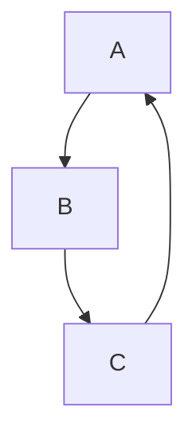
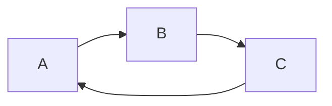
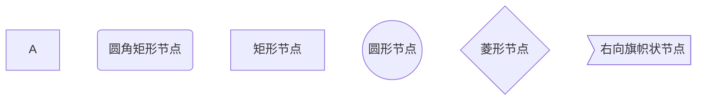
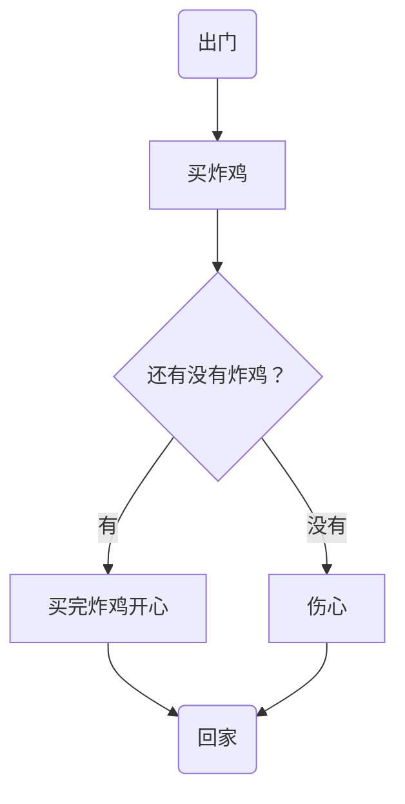
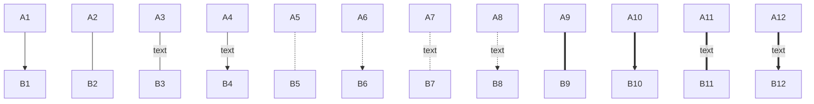
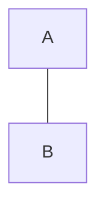
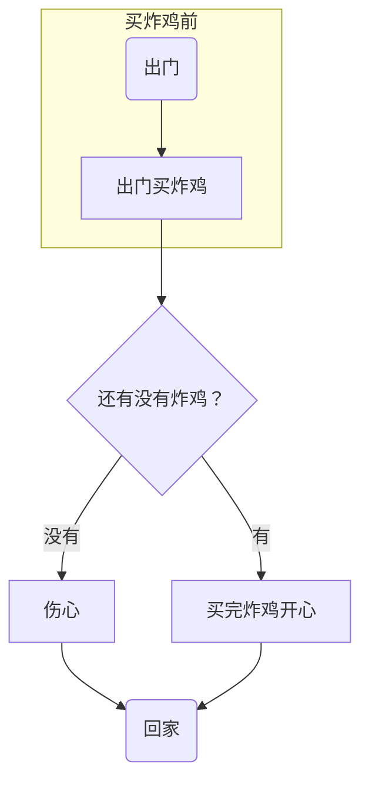
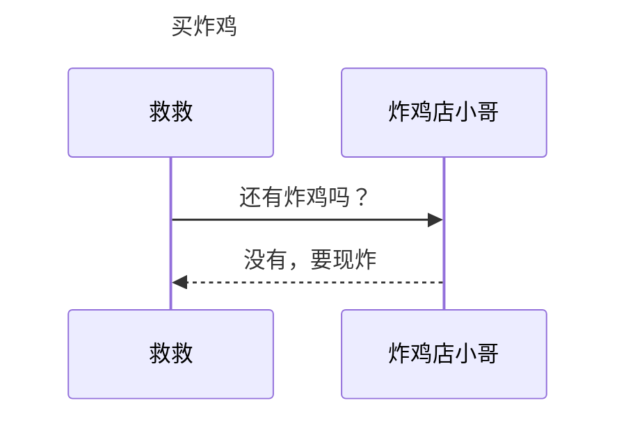
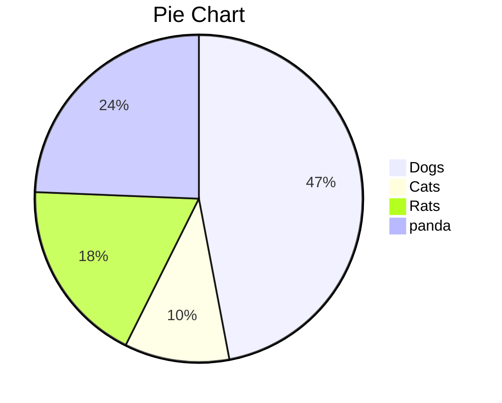
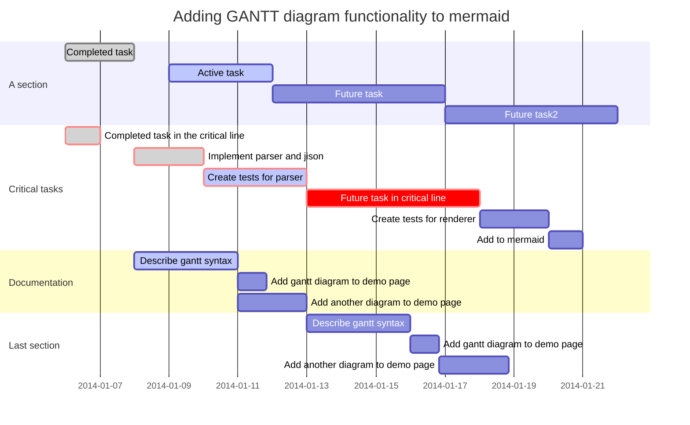

# MarkDown基础

[基础篇视频讲解链接](https://www.bilibili.com/video/av87982836#reply2366896129)
[画图篇视频讲解链接](https://www.bilibili.com/video/av88551739/)

## 标题

```markdown
# 标题名字（井号的个数代表标题的级数）
```

# 一级标题使用1个#

## 二级标题使用2个#

### 三级标题使用3个#

#### 四级标题使4用个#

##### 五级标题使用5个#

###### 六级标题使用6个#

####### 最多支持六级标题#

## 文字

### 删除线

```markdown
这就是 ~~删除线~~ (使用波浪号)
```

这就是 ~~删除线~~ (使用波浪号)

### 斜体

```markdown
这是用来 *斜体* 的 _文本_
```

这是用来 *斜体* 的 _文本_

### 加粗

```markdown
这是用来 **加粗** 的 __文本__
```

这是用来 **加粗** 的 __文本__

### 斜体+加粗

```markdown
这是用来 ***斜体+加粗*** 的 ___文本___
```

这是用来 ***斜体+加粗*** 的 ___文本___

### 下划线

下划线是HTML语法

`下划线` <u>下划线(快捷键`command`+`u`，视频中所有的快捷键都是针对Mac系统，其他系统可自行查找，Windows下的为ctrl + u)</u>

### 高亮（需勾选扩展语法）

```markdown
这是用来 ==斜体+加粗== 的文本
```

这是用来 ==斜体+加粗== 的文本

### 下标（需勾选扩展语法）

```markdown
水 H~2~O 
双氧水 H~2~O~2~ 
```

水 H~2~O 

双氧水 H~2~O~2~

### 上标（需勾选扩展语法）

```markdown
面积 m^2^ 
体积 m^3^
```

面积 m^2^ 
体积 m^3^

### 表情符号

 Emoji 支持表情符号，你可以用系统默认的 Emoji 符号（ Windows 用户不一定支持，自己试下~）。 也可以用图片的表情，输入 `:` 将会出现智能提示。  

#### 一些表情例子

```markdown
:smile: :laughing: :dizzy_face: :sob: :cold_sweat: :sweat_smile:  :cry: :triumph: :heart_eyes: :relaxed: :sunglasses: :weary:

:+1: :-1: :100: :clap: :bell: :gift: :question: :bomb: :heart: :coffee: :cyclone: :bow: :kiss: :pray: :sweat_drops: :hankey: :exclamation: :anger:

```

:smile: :laughing: :dizzy_face: :sob: :cold_sweat: :sweat_smile:  :cry: :triumph: :heart_eyes: :relaxed: :sunglasses: :weary: :+1: :-1: :100: :clap: :bell: :gift: :question: :bomb: :heart: :coffee: :cyclone: :bow: :kiss: :pray: :sweat_drops: :hankey: :exclamation: :anger:

(  Mac: `control`+`command`+`space`点选)

### 表格

使用 `|` 来分隔不同的单元格，使用 `-` 来分隔表头和其他行：

```markdown
name | price
--- | ---
fried chicken | 19
cola|5
```

> 为了使 Markdown 更清晰，`|` 和 `-` 两侧需要至少有一个空格（最左侧和最右侧的 `|` 外就不需要了）。

| name          | price |
| ------------- | ----- |
| fried chicken | 19    |
| cola          | 5     |

为了美观，可以使用空格对齐不同行的单元格，并在左右两侧都使用 `|` 来标记单元格边界，在表头下方的分隔线标记中加入 `:`，即可标记下方单元格内容的对齐方式：

```markdown
|    name       | price |
| :------------ | :---: |
| fried chicken | 19    |
| cola          |  32   |
```

| name          | price |
| :------------ | :---: |
| fried chicken |  19   |
| cola          |  32   |

使用快捷键`command`+`opt`+`T`更方便(段落→表格→插入表格，即可查看快捷键)


## 引用

```markdown
>“后悔创业”
```

> “后悔创业”

```markdown
>也可以在引用中
>>使用嵌套的引用
```

>也可以在引用中
>
>>使用嵌套的引用

## 列表

### 无序列表--符号 空格

```markdown
* 可以使用 `*` 作为标记
+ 也可以使用 `+`
- 或者 `-`
```


* 可以使用 `*` 作为标记

+ 也可以使用 `+`

- 或者 `-`

### 有序列表--数字 `.` 空格

```markdown
1. 有序列表以数字和 `.` 开始；
3. 数字的序列并不会影响生成的列表序列；
4. 但仍然推荐按照自然顺序（1.2.3...）编写。
```

1. 有序列表以数字和 `.` 开始；

2. 数字的序列并不会影响生成的列表序列；

3. 但仍然推荐按照自然顺序（1.2.3...）编写。

   ```markdown
   可以使用：数字\. 来取消显示为列表（用反斜杠进行转义）
   ```

## 代码

### 代码块

```markdown
```语言名称
```

```java
 public static void main(String[] args) {
    }
```

### 行内代码

```markdown
也可以通过 ``，插入行内代码（` 是 `Tab` 键上边、数字 `1` 键左侧的那个按键）：

例如 `Markdown`
```

`Markdown`


### 转换规则

代码块中的文本（包括 Markdown 语法）都会显示为原始内容

## 分隔线

可以在一行中使用三个或更多的 `*`、`-` 或 `_` 来添加分隔线（``）：

```markdown
***
------
___
```

***

------

_____

## 跳转

### 外部跳转--超链接

格式为 `[link text](link)`。

```markdown
[帮助文档](https://support.typora.io/Links/#faq)
```

[帮助文档](https://support.typora.io/Links/#faq)

### 内部跳转--本文件内跳（Typora支持）

格式为 `[link text](#要去的目的地--标题）`。

```markdown
[我想跳转](#饼图（Pie）)
```

>Open Links in Typora
>
>You can use `command+click` (macOS), or `ctrl+click` (Linux/Windows) on links in Typora to jump to target headings, or open them in Typora, or open in related apps.

[我想跳转](#饼图（Pie）)

### 自动链接

使用 `<>` 包括的 URL 或邮箱地址会被自动转换为超链接：

```markdown
<https://www.baidu.com>

<123@email.com>
```

<https://www.baidu.com>

[123@email.com](mailto:123@email.com)

## 图片

```markdown

```

### 网上的图片

```markdown

```


### 本地图片

```markdown

在同一个文件夹里（用相对路径）
或者直接拷贝
```


## 利用Markdown画图（需勾选扩展语法）


markdown画图也是轻量级的，功能并不全。

Mermaid 是一个用于画流程图、状态图、时序图、甘特图的库，使用 JS 进行本地渲染，广泛集成于许多 Markdown 编辑器中。Mermaid 作为一个使用 JS 渲染的库，生成的不是一个“图片”，而是一段 HTML 代码。

（不同的编辑器渲染的可能不一样）

### 流程图(graph)

#### 概述

```markdown
graph 方向描述
    图表中的其他语句...
```

关键字graph表示一个流程图的开始，同时需要指定该图的方向。

其中“方向描述”为：

| 用词 | 含义     |
| :--- | :------- |
| TB   | 从上到下 |
| BT   | 从下到上 |
| RL   | 从右到左 |
| LR   | 从左到右 |

> T = TOP，B = BOTTOM，L = LEFT，R = RIGHT，D = DOWN

最常用的布局方向是TB、LR。

```markdown
graph TB;
  A-->B
  B-->C
  C-->A
 
```




```markdown
graph LR;
  A-->B
  B-->C
  C-->A
```




#### 流程图常用符号及含义

##### 节点形状

| 表述       | 说明           | 含义                                                 |
| :--------- | :------------- | ---------------------------------------------------- |
| id[文字]   | 矩形节点       | 表示过程，也就是整个流程中的一个环节                 |
| id(文字)   | 圆角矩形节点   | 表示开始和结束                                       |
| id((文字)) | 圆形节点       | 表示连接。为避免流程过长或有交叉，可将流程切开。成对 |
| id{文字}   | 菱形节点       | 表示判断、决策                                       |
| id>文字]   | 右向旗帜状节点 |                                                      |

**单向箭头线段**：表示流程进行方向

>id即为节点的唯一标识，A~F 是当前节点名字，类似于变量名，画图时便于引用
>
>括号内是节点中要显示的文字，默认节点的名字和显示的文字都为A


```markdown
graph TB
  A
  B(圆角矩形节点)
  C[矩形节点]
  D((圆形节点))
  E{菱形节点}
  F>右向旗帜状节点] 
```




``` markdown
graph TB
    begin(出门)--> buy[买炸鸡]
    buy --> IsRemaining{"还有没有炸鸡？"}
    IsRemaining -->|有|happy[买完炸鸡开心]--> goBack(回家)
    IsRemaining --没有--> sad["伤心"]--> goBack
    
```




##### 连线

```markdown
graph TB
  A1-->B1
  A2---B2
  A3--text---B3
  A4--text-->B4
  A5-.-B5
  A6-.->B6
  A7-.text.-B7
  A8-.text.->B8
  A9===B9
  A10==>B10
  A11==text===B11
  A12==text==>B12
```






##### 子图表

使用以下语法添加子图表

```markdown
subgraph 子图表名称
    子图表中的描述语句...
end
```

```markdown
graph TB
	  subgraph 买炸鸡前
   			 begin(出门)--> buy[出门买炸鸡]
    end
    buy --> IsRemaining{"还有没有炸鸡？"}
    IsRemaining --没有--> sad["伤心"]--> goBack(回家)
    IsRemaining -->|有|happy[买完炸鸡开心]--> goBack
```



### 序列图(sequence diagram)

#### 概述

```markdown
sequenceDiagram 
	[参与者1][消息线][参与者2]:消息体
    ...
```

>`sequenceDiagram` 为每幅时序图的固定开头

```markdown
sequenceDiagram
		Title: 买炸鸡
    救救->>炸鸡店小哥: 还有炸鸡吗？
    炸鸡店小哥-->>救救: 没有，要现炸


```




#### 参与者（participant）

传统时序图概念中参与者有角色和类对象之分，但这里我们不做此区分，用参与者表示一切参与交互的事物，可以是人、类对象、系统等形式。中间竖直的线段从上至下表示时间的流逝。

```markdown
sequenceDiagram
    participant 参与者 1
    participant 参与者 2
    ...
    participant 简称 as 参与者 3 #该语法可以在接下来的描述中使用简称来代替参与者 3
```

>`participant <参与者名称>` 声明参与者，语句次序即为参与者横向排列次序。

#### 消息线

| 类型 | 描述                         |
| :--- | :--------------------------- |
| ->   | 无箭头的实线                 |
| -->  | 无箭头的虚线                 |
| ->>  | 有箭头的实线（主动发出消息） |
| –->> | 有箭头的虚线（响应）         |
| -x   | 末端为叉的实线（表示异步）   |
| --x  | 末端为叉的虚线（表示异步）   |

#### 处理中-激活框

从消息接收方的时间线上标记一小段时间，表示对消息进行处理的时间间隔。

在消息线末尾增加 `+` ，则消息接收者进入当前消息的“处理中”状态；
在消息线末尾增加 `-` ，则消息接收者离开当前消息的“处理中”状态。

```markdown
sequenceDiagram
    participant 99 as 救救
    participant seller as 炸鸡店小哥
    99 ->> seller: 还有炸鸡吗？
    seller -->> 99: 没有，要现炸。
    99 -x +seller:给我炸！
    seller -->> -99: 您的炸鸡好了！
```

```mermaid
sequenceDiagram
    participant 99 as 救救
    participant seller as 炸鸡店小哥
    99 ->> seller: 还有炸鸡吗？
    seller -->> 99: 没有，要现炸。
    99 -x +seller:给我炸！
    seller -->> -99: 您的炸鸡好了！
    
```

#### 注解（note）

语法如下

```markdown
Note 位置表述 参与者: 标注文字
```

其中位置表述可以为

| 表述     | 含义                       |
| :------- | :------------------------- |
| right of | 右侧                       |
| left of  | 左侧                       |
| over     | 在当中，可以横跨多个参与者 |

```markdown
sequenceDiagram
    participant 99 as 救救
    participant seller as 炸鸡店小哥
    Note over 99,seller : 热爱炸鸡
    Note left of 99 : 女
    Note right of seller : 男
    99 ->> seller: 还有炸鸡吗？
    seller -->> 99: 没有，要现炸。
    99 -x +seller : 给我炸！
    seller -->> -99: 您的炸鸡好了！


```

```mermaid
sequenceDiagram
    participant 99 as 救救
    participant seller as 炸鸡店小哥
    Note over 99,seller : 热爱炸鸡
    Note left of 99 : 女
    Note right of seller : 男
    99 ->> seller: 还有炸鸡吗？
    seller -->> 99: 没有，要现炸。
    99 -x +seller : 给我炸！
    seller -->> -99: 您的炸鸡好了！

```

#### 循环（loop）

在条件满足时，重复发出消息序列。（相当于编程语言中的 while 语句。）

```markdown
sequenceDiagram
    participant 99 as 救救
    participant seller as 炸鸡店小哥
   
    99 ->> seller: 还有炸鸡吗？
    seller -->> 99: 没有，要现炸。
    99 ->> +seller:给我炸！
    loop 三分钟一次
        99 ->> seller : 我的炸鸡好了吗？
        seller -->> 99 : 正在炸
    end
    seller -->> -99: 您的炸鸡好了！
```


```mermaid
sequenceDiagram
    participant 99 as 救救
    participant seller as 炸鸡店小哥
   
    99 ->> seller: 还有炸鸡吗？
    seller -->> 99: 没有，要现炸。
    99 ->> +seller:给我炸！
    loop 三分钟一次
        99 ->> seller : 我的炸鸡好了吗？
        seller -->> 99 : 正在炸
    end
    seller -->> -99: 您的炸鸡好了！
```

#### 选择（alt）

在多个条件中作出判断，每个条件将对应不同的消息序列。（相当于 if 及 else if 语句。）

```markdown
sequenceDiagram    
    participant 99 as 救救
    participant seller as 炸鸡店小哥
    99 ->> seller : 现在就多少只炸好的炸鸡？
    seller -->> 99 : 可卖的炸鸡数
    
    alt 可卖的炸鸡数 > 3
        99 ->> seller : 买三只！
    else 1 < 可卖的炸鸡数 < 3
        99 ->> seller : 有多少买多少
    else 可卖的炸鸡数 < 1
        99 ->> seller : 那我明天再来
    end

    seller -->> 99 : 欢迎下次光临
```

```mermaid
sequenceDiagram    
    participant 99 as 救救
    participant seller as 炸鸡店小哥
    99 ->> seller : 现在就多少只炸好的炸鸡？
    seller -->> 99 : 可卖的炸鸡数
    
    alt 可卖的炸鸡数 > 3
        99 ->> seller : 买三只！
    else 1 < 可卖的炸鸡数 < 3
        99 ->> seller : 有多少买多少
    else 可卖的炸鸡数 < 1
        99 ->> seller : 那我明天再来
    end

    seller -->> 99 : 欢迎下次光临
```

#### 可选（opt）

在某条件满足时执行消息序列，否则不执行。相当于单个分支的 if 语句。

```markdown
sequenceDiagram
    participant 99 as 救救
    participant seller as 炸鸡店小哥
    99 ->> seller : 买炸鸡
    opt 全都卖完了
        seller -->> 99 : 下次再来
    end
```


```mermaid
sequenceDiagram
    participant 99 as 救救
    participant seller as 炸鸡店小哥
    99 ->> seller : 买炸鸡
    opt 全都卖完了
        seller -->> 99 : 下次再来
    end
```

#### 并行（Par）

将消息序列分成多个片段，这些片段并行执行。

```markdown
sequenceDiagram
   participant 99 as 救救
   participant seller as 炸鸡店小哥
   
    99 ->> seller : 一个炸鸡，一杯可乐！

    par 并行执行
        seller ->> seller : 装可乐
    and
        seller ->> seller : 炸炸鸡
    end

    seller -->> 99 : 您的炸鸡好了！
```

```mermaid
sequenceDiagram
   participant 99 as 救救
   participant seller as 炸鸡店小哥
   
    99 ->> seller : 一个炸鸡，一杯可乐！

    par 并行执行
        seller ->> seller : 装可乐
    and
        seller ->> seller : 炸炸鸡
    end

    seller -->> 99 : 您的炸鸡好了！
```


### 饼图（Pie）

```markdown
pie
    title Pie Chart
    "Dogs" : 386
    "Cats" : 85
    "Rats" : 150 
```



> [Typora支持mermaid的官方链接](http://support.typora.io/Draw-Diagrams-With-Markdown/)

### 甘特图（gantt）

```markdown
  title 标题
	dateFormat 日期格式
	section 部分名
	任务名:参数一, 参数二, 参数三, 参数四，参数五
 
  //参数一：crit（是否重要，红框框） 或者 不填
  //参数二：done（已完成）、active（正在进行） 或者 不填(表示为待完成状态)
  //参数三：取小名 或者 不填
  //参数四：任务开始时间
  //参数五：任务结束时间
```

> [官方教程](https://mermaid-js.github.io/mermaid/#/gantt)

```
gantt
       dateFormat  YYYY-MM-DD
       title Adding GANTT diagram functionality to mermaid

       section A section
       Completed task            :done,    des1, 2014-01-06,2014-01-08
       Active task               :active,  des2, 2014-01-09, 3d
       Future task               :         des3, after des2, 5d
       Future task2              :         des4, after des3, 5d

       section Critical tasks
       Completed task in the critical line :crit, done, 2014-01-06,24h
       Implement parser and jison          :crit, done, after des1, 2d
       Create tests for parser             :crit, active, 3d
       Future task in critical line        :crit, 5d
       Create tests for renderer           :2d
       Add to mermaid                      :1d

       section Documentation
       Describe gantt syntax               :active, a1, after des1, 3d
       Add gantt diagram to demo page      :after a1  , 20h
       Add another diagram to demo page    :doc1, after a1  , 48h

       section Last section
       Describe gantt syntax               :after doc1, 3d
       Add gantt diagram to demo page      :20h
       Add another diagram to demo page    :48h
```



## Typora快捷方式（系统默认）

### 文件

| 功能               | 热键 (Windows/Linux) | 热键 (macOS)         |
| :----------------- | :------------------- | -------------------- |
| 新建               | Ctrl + N             | Command  + N         |
| 新窗口             | Ctrl + Shift + N     | Command  +Shift + N  |
| 新标签             | *（不支持）*         | Command  + T         |
| 打开               | Ctrl + O             | Command  + O         |
| 快速打开           | Ctrl + P             | Command  + Shift + O |
| 重新打开关闭的文件 | Ctrl + Shift + T     | Command  + Shift + T |
| 保存               | Ctrl + S             | Command  + S         |
| 另存为/复制        | Ctrl + Shift + S     | Command + Shift + S  |
| 关闭               | Ctrl + W             | Command  + W         |

### 编辑

| 功能                                | 热键 (Windows/Linux)       | 热键 (macOS)                        |
| :---------------------------------- | :------------------------- | ----------------------------------- |
| 新段落                              | Enter                      | Enter                               |
| 新行                                | Shift + Enter              | Shift + Enter                       |
| 剪切                                | Ctrl + X                   | Command  + X                        |
| 复制                                | Ctrl + C                   | Command  + C                        |
| 粘贴                                | Ctrl + V                   | Command  + V                        |
| 复制为 Markdown                     | Ctrl + Shift + C           | Command + Shift + C                 |
| 粘贴为纯文本                        | Ctrl + Shift + V           | Command + Shift + V                 |
| 全选                                | Ctrl + A                   | Command + A                         |
| 选择行/句子 选择行（在表格中）      | Ctrl + L                   | Command + L                         |
| 删除行（在表中）                    | Ctrl + Shift + Backspace   | Command + Shift + Backspace         |
| 选择样式范围 选择单元格（在表格中） | Ctrl + E                   | Command + E                         |
| 选择单词                            | Ctrl + D                   | Command + D                         |
| 删除单词                            | Ctrl + Shift + D           | Command + Shift + D                 |
| 跳到顶部                            | Ctrl + home                | Command + ↑                         |
| 跳转到选择                          | Ctrl + J                   | Command + J                         |
| 跳到底部                            | Ctrl + end                 | Command + ↓                         |
| 寻找                                | Ctrl + F                   | Command + F                         |
| 找下一个                            | F3 / Enter                 | Command + G / Enter                 |
| 查找上一个                          | Shift + F3 / Shift + Enter | Command + Shift + G / Shift + Enter |
| 代替                                | Ctrl + H                   | Command + H                         |

### 段落

| 功能           | 热键 (Windows/Linux)   | 热键 (macOS)              |
| :------------- | :--------------------- | ------------------------- |
| 标题 1 至 6    | Ctrl + 1/2/3/4/5/6     | Command + 1/2/3/4/5/6     |
| 增加标题级别   | Ctrl + =               | Command + =               |
| 降低标题级别   | Ctrl + -               | Command  + -              |
| 桌子           | Ctrl + T               | Command + Option + T      |
| 代码围栏       | Ctrl + Shift + K       | Command  + Option + C     |
| 数学块         | Ctrl + Shift + M       | Command + Option + B      |
| 引用           | Ctrl + Shift + Q       | Command  + Option + Q     |
| 有序列表       | Ctrl + Shift + [       | Command + Option + O      |
| 无序列表       | Ctrl + Shift + ]       | Command + Option + U      |
| 缩进一个制表符 | Ctrl + [ / Tab         | Command + [ / Tab         |
| 前进一个制表符 | Ctrl + ] / Shift + Tab | Command + ] / Shift + Tab |

### 格式

| 功能     | 热键 (Windows/Linux) | 热键 (macOS)        |
| :------- | :------------------- | ------------------- |
| 字体加粗 | Ctrl + B             | Command + B         |
| 斜体     | Ctrl + I             | Command +I          |
| 下划线   | Ctrl + U             | Command + U         |
| 代码     | Ctrl + Shift + ` |Command + Shift + `|
| 删除线   | Alt + Shift + 5      | Control+ Shift + `  |
| 超链接   | Ctrl + K             | Command  + K        |
| 图片     | Ctrl + Shift + I     | Command +Control+I  |
| 清除格式 | Ctrl + \             | Command + \         |

### view

| 功能                 | 热键 (Windows/Linux) | 热键 (macOS)         |
| :------------------- | :------------------- | -------------------- |
| 切换侧边栏           | Ctrl + Shift + L     | Command + Shift + L  |
| 显示大纲             | Ctrl + Shift + 1     | Command + 控制 + 1   |
| 显示文件             | Ctrl + Shift + 2     | Command + 控制 + 2   |
| 显示文件树           | Ctrl + Shift + 3     | Command + 控制 + 3   |
| 源代码模式(再次取消) | Ctrl + /             | Command + /          |
| 对焦模式             | F8                   | F8                   |
| 打字机模式           | F9                   | F9                   |
| 切换全屏             | F11                  | Command + Option + F |
| 真实大小             | Ctrl + Shift + 0     | *（不支持）*         |
| 放大                 | Ctrl + Shift + =     | *（不支持）*         |
| 缩小                 | Ctrl + Shift + -     | *（不支持）*         |
| 在打开的文档之间切换 | Ctrl + Tab           | 命令 + `             |

## Typora自定义快捷方式

Typora有些功能是没有快捷键的，需要使用者自定义。这里以给`内联公式`设置快捷键为例，讲解如何自定义快捷键。

### 给内联公式设置自定义快捷方式

1. 在进行设置前，推荐将软件的语言设置称英语，理由后面再说。具体操作:
   文 件 ⟹ 偏 好 设 置 ⟹ 通 用 ⟹ 语 言 ， 选 择 ‘ English ’ ， 重 新 启 动 。
2. 重新启动完成后，查看二级菜单中`内联公式`的英文名称是`Inline Math`，记下该拼写。
3. 再次打开`偏好设置`（快捷键`Ctrl+,`），在`通用`中找到`高级设置`，具体操作：File ⟹ Preferences ⟹ General ⟹ Open Advanced Setting


4. 之后会显示一个文件夹，有两个配置文件，选择`conf.user.json`（在另一个文件中设置无效），打开之后找到`keyBinding`，在下面添加`"Inline Math":"Ctrl+M"`（这里的快捷键我设置成了`Ctrl +M`，在保证快捷键不冲突的条件下，可以随意设置），如图所示

   

保存配置文件，重启Typora，可以发现在选项`Inline Math`旁边显示了快捷键`Ctrl +M`，经过测试快捷键能正常使用。

### 为什么不在中文环境下配置？

在中文环境下，也可以进行设置，在配置文件中添加`"内联公式":"Ctrl+M"`，也可以换成`"Inline Math":"Ctrl+M"`，在不知道菜单选项的英文名称时可以直接写上对应的中文名称（所以推荐在开始设置前将Typora设置成英文环境，便于查看菜单项的英文名称），如


重启Typora


中文菜单`内联公式`旁出现了设置的快捷键，表示快捷键设置成功。
但是我如果心血来潮，想切换成英文环境，再查看菜单项的快捷键时发现快捷键没有了


如果当初我在配置文件中使用`"Inline Math":"Ctrl+M"`，不使用中文的名称，无论我将Typora的语言环境设置成何种语言，都不会影响自定义快捷键的使用。

